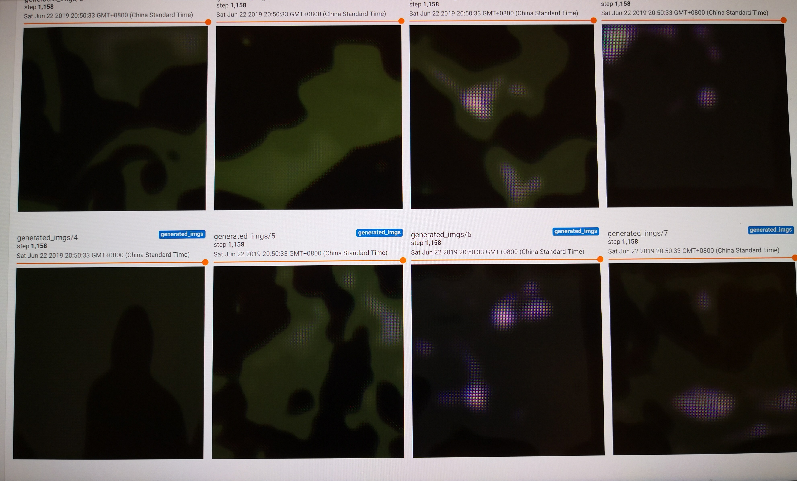
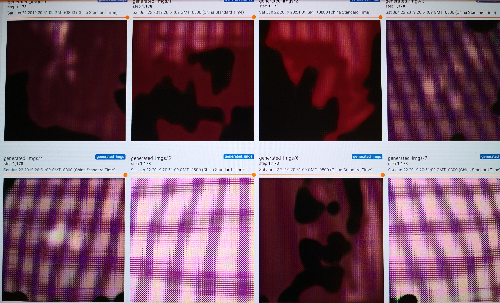
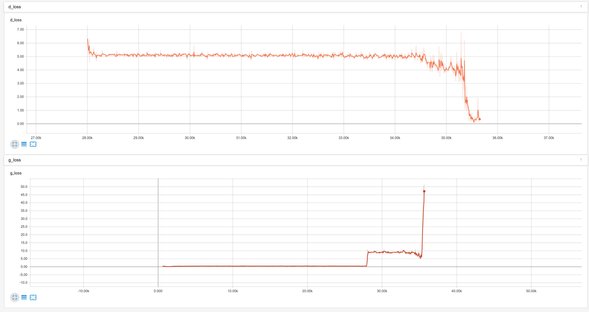
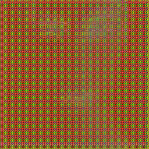

# Some personal tips about training a GAN (CartoonGAN)

During traing the CartoonGAN that I have built, there are numerous problems and obstacles that I encountered. This is the repo that tracks the problems and stores the solutions.

(This maybe useful for those whoever tries to train a GAN for the first time, veteran of GAN don't need to read more :) )

## Problem 1 : Train `D` and `G` togerther from the very begining.

Here are the two generated imgs that I have obtained at different batches under this scenario:

There are two notable features of the generated images:
* Liquid like pattern.
* Grid noises.

This is due to the fact that constrain from discriminator is too strong, and generator could not find a way to make readable (real) images. After several epochs, the images will all turn to black, and `D` loss goes down to 0 and `G` loss goes up to extreme high.

**SOLUTION**:
The solution that I figured out is to first train generators for 20-30 epochs in order to make it have some ability to generate images. Since CartoonGAN has some minor differences with other GAN's: it generates cartoonized images based on the real image (as input). The generator should have some ability to generate images in order to cartoonize it.

## Problem 2 : The discriminator is too strong

This is a common problem when training a GAN. Under this scenario, I have already train generator for 50 epochs. Here is the loss function of generator and discriminator:

From the image, it is easy to spot that to certain point, the discriminator becomes too strong again and generator lost its ability to generate images. 

**SOLUTION**: The solution that I find is to follows the tips from [https://github.com/soumith/ganhacks](https://github.com/soumith/ganhacks) which gives some decent points about how to sharpen the ability of discriminator. (label smoothing, and flip labels may be helpful).

## Problem 3 : The generated image has notable grid noise patterns

The image above is what I have obtained during the training of generator. Easy to see that it is a face but with no clear detials. 

**SOLUTION**: NO SOLUTION. This is not a problem actually! The grid noise is due to the effect of `Conv2dTranspose` layer. All have to do is to train more epochs for the generator so that it will have clear patterns and when discriminator starts to work, the noise will disapear.